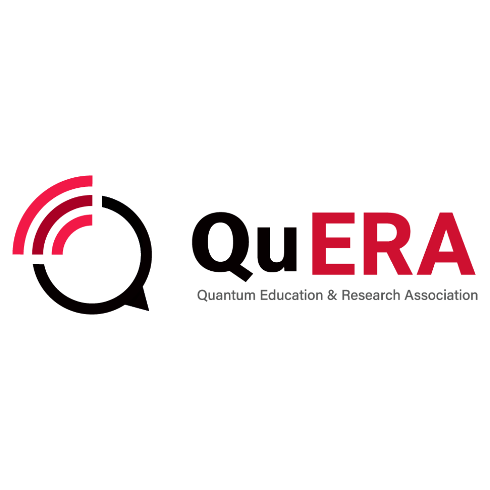

#

 
 

# 
제2회 QuERA Quantum Festival

> 
> 제2회 QuERA Quantum Festival 홍보 페이지입니다.
>
> 부산대학교 양자컴퓨팅동아리 QuERA가 주최하는 양자컴퓨팅 입문 행사로,
> QCNN(Quantum Convolutional Neural Network)을 메인 주제로 한 강의·실습·퀴즈·네트워킹이 진행됩니다.
> 
> 행사 일자: 2026.05.29 (금) 10:00 - 18:00
>
> 행사 장소: 부산대학교 IT관(102) 306호
>

## 🛠️참여자

<table>
<tr>
<td align="center">
<a href="https://github.com/KimHaejoong1">

 
<b>KimHaejoong1</b>
</a>
 

</tr>
</table>

## 🌐링크

